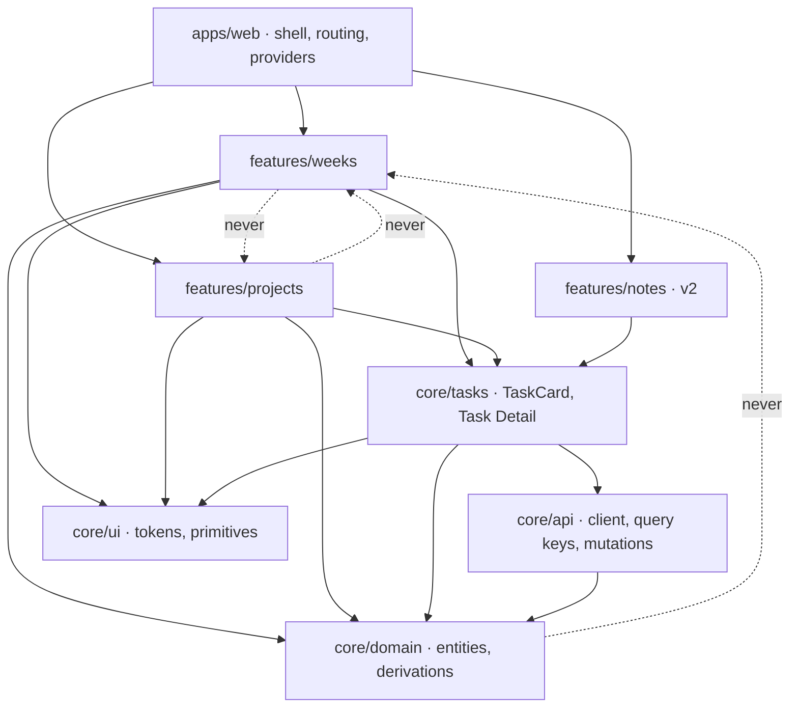
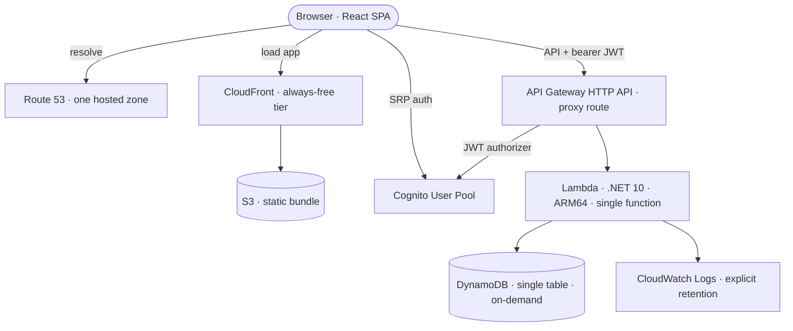
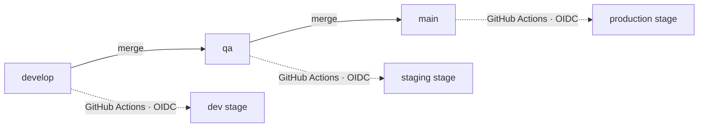
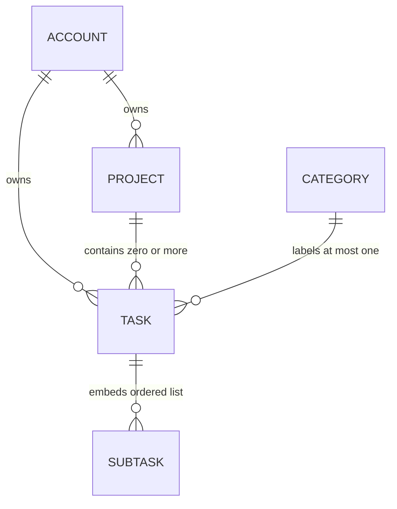

# Architecture Spine — Litmus

## Design Paradigm

**Modular monolith with a shared domain core and surface projections**, mirrored on both sides of the wire.

One SPA bundle, one Lambda function. Inside each, code is divided into a **core** that owns the entities and every rule derived from them, and **feature modules** that are *projections* — a surface, its layout, its queries, its interactions — over that core. A feature module owns how work is *shown*; it never owns what work *is*.

This is chosen against the specific failure the PRD names in §4.7: Week Board and Project Board are two views of one Task, and an implementation that builds them as independent surfaces will drift on status, progress and date handling. Making the shared thing structural rather than documentary means FR-35, FR-36 and FR-37 cannot be violated without breaking a dependency rule or a build.

| Paradigm layer | Frontend | Backend |
| --- | --- | --- |
| Core — entities, derivations, contract | `libs/core/*` | `Litmus.Core.*` |
| Feature — one surface each | `libs/features/*` | `Litmus.Modules.*` |
| Host — composition, routing, wiring | `apps/web` | `Litmus.Api` |

## Invariants & Rules



### AD-1 — The core owns Task and Project; features are projections

- **Binds:** all frontend and backend modules
- **Prevents:** Week Board and Project Board each growing their own Task model, status transitions and date handling — the drift PRD §4.7 exists to stop
- **Rule:** `Task`, `Project`, `Status`, `Category`, `Subtask` and every function derived from them are declared in `core/domain` (TS) and `Litmus.Core.Domain` (C#). A feature module may define view models over these types but may not redefine, extend or shadow them, and may not implement a state transition the core does not expose.

### AD-2 — Feature modules never depend on one another

- **Binds:** `features/weeks`, `features/projects`, `features/notes` (v2), `Litmus.Modules.*`
- **Prevents:** an epic wiring one surface directly into another, producing a cycle that makes either impossible to change or delete alone
- **Rule:** dependencies flow `host → feature → core` only. Enforced mechanically: Nx tags (`tier:app`, `tier:feature`, `tier:core`) with `@nx/enforce-module-boundaries` on the TypeScript side, and one-way project references on the .NET side. A feature needing something from another feature is a signal that the thing belongs in the core; move it there.

### AD-3 — Derived values are computed at read time and never persisted

- **Binds:** Progress, `N of M tasks done`, per-column and per-day task counts, `N due this week`, subtask fractions
- **Prevents:** a stored counter drifting out of step because one mutation path forgot to update it — after which Progress is wrong permanently and silently, and the Project Card, list row and detail header disagree
- **Rule:** no aggregate is ever written to the datastore. Every count and percentage is a pure function in `core/domain` applied to the task set already in hand, and every surface calls that same function. A Project's displayed freshness (FR-24's `Updated 2h ago`) is derived the same way — `max(project.updatedAt, max(updatedAt of its tasks))` — never a stored field that a child write is expected to bump. **Tripwire:** revisit if one account exceeds ~2,000 tasks; the design assumes a working set that fits one response.

### AD-4 — Due Date is a calendar day, not an instant

- **Binds:** `Task.dueDate`, `Task.timeRange`, Week Board membership, `due this week` counts, the New Project modal's starter tasks
- **Prevents:** a task landing on the wrong day column for a user not on UTC — and two modules disagreeing about which day a task belongs to because one parsed a timestamp and the other a date
- **Rule:** `dueDate` is a `YYYY-MM-DD` string, stored and transported as such, never a UTC instant and never `Date`-parsed into one. Week membership is computed by string comparison against the displayed week's Monday and Sunday. A Task's time range (FR-20, and the optional time on the card in FR-12) is the same kind of value: a pair of local `HH:mm` strings scoped to that `dueDate`, never instants, and meaningless without one. Audit timestamps (`createdAt`, `updatedAt`) are separately ISO-8601 UTC instants and are never used for scheduling.

### AD-5 — Status and Category have exactly one definition

- **Binds:** FR-19, FR-30, FR-31, FR-36, FR-37
- **Prevents:** a fourth status value, a hidden status, or a category list that differs between surfaces
- **Rule:** `Status` is the closed enum `ToDo | InProgress | Done`, defined in `Litmus.Core.Domain`, published through the OpenAPI contract, and generated into TypeScript. Category is single-valued and drawn from one list in the core. For v1 that list is a fixed constant — Design, Dev, QA, Docs — with no management surface, which closes PRD Q7 for v1; a feature module must not add one. Neither enum may be widened, narrowed or re-declared in a feature module.

### AD-6 — One partition per user; the user id comes only from the token

- **Binds:** every datastore access
- **Prevents:** a query that forgets to scope by user, and any endpoint that lets a caller name whose data it wants
- **Rule:** DynamoDB single-table design, partition key `USER#{sub}`, sort key `PROJECT#{id}` or `TASK#{id}`. The `sub` is read **only** from the API Gateway JWT authorizer's claims — never from a request body, path segment or query parameter, in any endpoint, ever. Persistence helpers take the `sub` as their first argument so an unscoped query cannot compile.

### AD-7 — Subtasks are embedded in their Task

- **Binds:** FR-21, the Task Card `2/5` fraction
- **Prevents:** two modules disagreeing about whether a subtask is an item or a field, and a task/subtask pair that can be read half-updated
- **Rule:** subtasks are an ordered list attribute on the task item — `{ id, title, done }` — written and read with the task in a single operation. They are never separate DynamoDB items, never separately addressable, and have no due date.

### AD-8 — The client generates entity ids

- **Binds:** all create operations
- **Prevents:** temporary-id reconciliation in optimistic inserts, and a retried create producing two records
- **Rule:** the client mints a UUIDv7 before issuing a create, and the optimistic cache entry uses the final id from birth. The server validates the format and rejects an id that already exists, which makes creates idempotent under retry.

### AD-9 — One Lambda, one Minimal API host, one module per route group

- **Binds:** the whole backend
- **Prevents:** function-per-route sprawl, and per-module divergence in middleware, auth, serialization or error handling
- **Rule:** a single .NET 10 Lambda runs an ASP.NET Core Minimal API via `AddAWSLambdaHosting(LambdaEventSource.HttpApi)`, behind an API Gateway HTTP API default proxy route. Each backend module exposes exactly one `MapXxxEndpoints(this IEndpointRouteBuilder)` extension, registered by `Litmus.Api`. Cross-cutting concerns are configured once in the host and never per module. The same host runs under Kestrel locally, so the full API is testable without deploying.

### AD-10 — The wire contract is generated, never written twice

- **Binds:** every type crossing the C#/TypeScript boundary
- **Prevents:** a hand-maintained TypeScript mirror of a C# DTO silently going stale — the classic split-stack drift
- **Rule:** the backend emits an OpenAPI document at build time; TypeScript request/response types are generated from it into `libs/core/api`. Generated files are committed and never hand-edited. A hand-written interface duplicating a server type is a defect, not a shortcut.

### AD-11 — One error shape

- **Binds:** every endpoint and every client error path
- **Prevents:** each module inventing its own error envelope, forcing per-surface error handling
- **Rule:** all non-2xx responses are RFC 9457 Problem Details, which ASP.NET Core produces natively. The client maps them in `core/api` alone; feature modules consume a normalized error type and never parse HTTP responses themselves.

### AD-12 — The read model is a workspace bootstrap plus lazy detail

- **Binds:** FR-9, FR-16, FR-23, FR-28, FR-29
- **Prevents:** each surface fetching its own slice, ending up with two cached copies of one task that can disagree on screen
- **Rule:** `GET /workspace` returns every Project and a lean Task index (id, title, status, dueDate, category, projectId, subtask counts, time range, priority). Both boards are pure selectors over that one response; task search (FR-16) is a client-side filter over it. Task descriptions and subtask bodies load on demand via `GET /tasks/{id}` when Task Detail opens. No feature module issues a list query of its own.

### AD-13 — One query-key factory, one cache entry, one invalidation door

- **Binds:** all client server-state
- **Prevents:** two modules keying the same data differently, so one updates and the other shows stale content
- **Rule:** all TanStack Query keys come from a single factory in `core/api`. The workspace index is one cache entry. Every mutation patches that entry optimistically and every invalidation passes through one exported function — which is also the seam where real-time push is later added without touching feature code.

### AD-14 — Every mutation is optimistic and goes through the core

- **Binds:** FR-13, FR-19, FR-21, FR-22, FR-30, FR-31, FR-35; the responsiveness NFR
- **Prevents:** a drag on one board feeling instant while the identical status change from a dropdown blocks on the network
- **Rule:** mutations are exposed as named operations from `core/api` (`setStatus`, `setDueDate`, `toggleSubtask`, …), each applying its optimistic patch and its rollback in one place. Feature modules call these; they never call the HTTP client directly and never write their own optimistic logic. A surface that changes state must be able to do so through an existing core operation or add one.

### AD-15 — Colour exists only as a token reference

- **Binds:** FR-2, the theming-integrity NFR, every `.module.css` file
- **Prevents:** hard-coded hex values that a theme switch cannot reach, leaving dark mode broken in whichever surface was built last
- **Rule:** the 21 design tokens are declared once as CSS custom properties on `:root` and `[data-theme="dark"]`. CSS Modules reference `var(--token)` only. A lint rule rejects colour literals in `.module.css`, making the NFR mechanical rather than reviewed. The theme attribute is set in one place by the shell, from the Account preference. A Project's colour is **stored as a token name** (`pastel-mint`), never a hex — the pastel family is the one group whose dark values are near-black tints rather than lightness inversions, so a stored hex cannot theme. Contrast is verified by an automated test over the token pairs against both `bg` values rather than by review — the theme-invariant `accent` and the six `dot-*` tokens are the known WCAG AA risk the PRD names.

### AD-16 — Every drag has a non-drag equivalent

- **Binds:** FR-30, FR-31, FR-34; the accessibility NFR
- **Prevents:** a status change reachable only by pointer drag, unusable by keyboard and awkward on touch
- **Rule:** drag is an accelerator, never the sole path. Any interaction that moves a Task between statuses or days must also be reachable through a control that changes the same core operation — the Task Detail segmented control, the list-view dropdown, or an explicit menu. New draggable surfaces inherit this obligation.

### AD-17 — The near-zero cost envelope

- **Binds:** every CDK stack in every environment
- **Prevents:** a single infrastructure choice quietly turning a free personal app into a monthly bill, and each environment diverging on which choice it made
- **Rule:** these are hard prohibitions in all three environments.
  - The Lambda is **never** placed in a VPC. A NAT Gateway is ~$32/month and would exceed the entire budget by itself; DynamoDB, Cognito and S3 are all reachable over public AWS endpoints with IAM.
  - API Gateway is **HTTP API**, never REST API ($1.00/M versus $3.50/M once the 12-month free tier lapses).
  - DynamoDB is **on-demand**; the always-free 25 WCU/RCU allowance applies to provisioned mode and is account-wide, which three environments cannot cleanly divide. On-demand costs cents at this volume.
  - The Cognito user pool tier is **Lite or Essentials**, never Plus, which has no free tier.
  - Every CloudWatch log group is created with an **explicit retention period**; the default never expires.
  - SnapStart is **not** enabled — it is free only for Java managed runtimes and bills continuously for .NET.
  - Point-in-time recovery **is** enabled on the production table; it bills on table size, which is a few megabytes.

### AD-18 — Environments are CDK stages; no environment identity in application code

- **Binds:** all three environments, both deployables
- **Prevents:** `if (env === "prod")` branches, and staging behaving differently from production for reasons nobody can find
- **Rule:** one AWS account, three CDK stages, resources named `litmus-{env}-*`. Application code reads configuration from environment variables and never names an environment. The frontend's API base URL is injected at build time from CDK outputs. Production stacks carry termination protection. The same artifact shape is built for every environment; only configuration differs.

### AD-19 — Branch-to-environment is the only promotion path

- **Binds:** CI/CD, all deploys
- **Prevents:** a local `cdk deploy` reaching staging or production, and environments whose contents nobody can trace to a commit
- **Rule:** `develop` → dev, `qa` → staging, `main` → production; a merge is the only trigger. GitHub Actions assumes an AWS role via **OIDC** — no long-lived access keys exist in any environment. Path filters build frontend, backend and infra independently. Production deploys additionally require the CDK diff to be clean of unexpected replacements.

### AD-20 — The browser calls nothing but its own origin and AWS

- **Binds:** every screen, the privacy NFR
- **Prevents:** a font link or an analytics snippet added on one surface quietly making the product phone home
- **Rule:** no third-party runtime request from any page. The Inter typeface and Phosphor Icons are **self-hosted** from the app's own origin — a Google Fonts link would violate this on every screen. No analytics, telemetry, error-reporting SaaS, or embeds. The only outbound origins are the app's own CloudFront distribution, its API Gateway domain, and Cognito.

### AD-21 — Tokens live in memory; the refresh token is the only persisted credential

- **Binds:** FR-5, FR-8, the auth screens, the session NFR
- **Prevents:** each surface inventing its own token storage and refresh timing, and access tokens sitting in `localStorage` for any script to read
- **Rule:** the custom auth screens call Cognito's SRP flow directly. Access and ID tokens are held in JavaScript memory only. The refresh token is the sole persisted credential, written by one auth module and read by nothing else; refresh is handled by a single interceptor in `core/api`. **Known accepted deviation:** the PRD's *"session tokens are not readable by page scripts"* is only partially met — the refresh token remains in browser storage. Fully meeting it requires the cookie-BFF pattern, considered and rejected as disproportionate for a single-user app.

### AD-22 — Task order is deterministic and derived

- **Binds:** every Task list — Week Board day columns, Project Board status columns, Project List rows
- **Prevents:** each surface sorting differently, and either one persisting a `sortOrder` field that the other neither writes nor respects
- **Rule:** list order comes from a single comparator in `core/domain`, applied by every surface: time range ascending where present, then priority, then title. Order is derived, never stored — v1 has no user-defined ordering and no `sortOrder` attribute anywhere. Adding manual reordering later is a datastore change and an amendment to this AD, not a feature-local decision.

### AD-23 — One mutation per entity at a time; a stale response never wins

- **Binds:** every optimistic mutation (AD-14)
- **Prevents:** a fast user silently losing an edit — a status change and a date change racing, where the first response replaces the cache entry wholesale and reverts the second
- **Rule:** mutations for one entity serialize in `core/api`; a second mutation for the same id queues behind the first. Every mutating endpoint returns the **complete updated entity**, and the client applies it only when no later mutation for that id is still pending — otherwise the response is discarded and the optimistic state stands until the queue drains. Failure is surfaced one way, defined once alongside the operation: roll the patch back and raise a non-blocking notice through the shell. A feature module never decides what a failed mutation looks like.

### AD-24 — Preferences live on the Account; view state lives in the URL

- **Binds:** FR-2 theme, FR-3 week start, FR-10 displayed week, FR-24 grid/list, FR-29 board/list
- **Prevents:** one surface persisting to `localStorage` and another to the Account — so the phone and the desktop agree about the theme and disagree about everything else
- **Rule:** anything the PRD says *persists* is stored on the Account and therefore syncs: theme, week start day, the Projects grid/list choice, and the per-Project board/list choice. Anything describing *what you are currently looking at* lives in the URL as a typed search param: the displayed week, the selected mobile day, the open Task. Browser storage holds exactly one thing — the refresh token (AD-21).

### AD-25 — Deleting a Project takes its Tasks with it

- **Binds:** Project deletion, `Task.projectId`
- **Prevents:** orphaned Tasks whose `projectId` resolves to nothing — which each surface then renders differently and the Week Board cannot label
- **Rule:** `projectId` never dangles. Deleting a Project deletes its Tasks, as chunked writes within the user's single partition, and the confirmation names the count (`Delete Website Redesign and its 15 tasks?`). Detaching them instead is not an option: a Task that silently loses its Project is indistinguishable from a bug. A Task with **no** `projectId` is valid — that is a Task created on the Week Board (FR-11) — but a Task pointing at a Project that does not exist is not.

### AD-26 — Every stored item declares its type and schema version

- **Binds:** every DynamoDB item
- **Prevents:** three modules each inferring an item's kind from its sort-key prefix in a slightly different way, and a v2 migration with nothing to migrate against
- **Rule:** every item carries `type` (`project` | `task`) and `schemaVersion` (integer, starting at 1) as ordinary attributes. Readers branch on `type`, never on parsing the key string. Changing a stored shape increments `schemaVersion` and ships with a reader tolerating both versions, so a deploy never needs a migration window. This is what the v2 Notes work migrates against.

### AD-27 — One breakpoint scale, mobile-first, no horizontal scroll

- **Binds:** every surface; the responsive NFR (390 px – 1600 px)
- **Prevents:** each epic inventing its own breakpoints — so the Week Board switches to its mobile layout at one width, the Project Board at another, and the Projects Dashboard (which has no mobile frame at all) at a third
- **Rule:** one breakpoint scale is declared once in `core/ui` as custom properties and consumed by every `.module.css`; a feature module never writes a raw pixel media query. Layouts are authored mobile-first from 390 px. The three designed mobile frames (`tqz8m`, `I33L1Q`, `Er1gs`) are exact targets; surfaces with no mobile frame — the Projects Dashboard and its list view — take the shared responsive fallback rather than a bespoke one. No page scrolls horizontally at any width in the range; overflow is handled inside the element that owns it, as FR-14 already requires of day columns.

## Consistency Conventions

| Concern | Convention |
| --- | --- |
| Frontend files & dirs | `kebab-case` directories; `PascalCase.tsx` components; co-located `Component.module.css`; one barrel `index.ts` per lib, which is the only import surface |
| Backend namespaces | `Litmus.Core.Domain`, `Litmus.Core.Persistence`, `Litmus.Modules.{Feature}`, `Litmus.Api`; one folder per module, endpoints in `{Feature}Endpoints.cs` |
| Entity naming | PRD Glossary terms verbatim — Task, Subtask, Status, Due Date, Category, Project, Progress. Synonyms (item, card, todo, ticket, list) are a defect in code, types, routes and copy alike |
| Ids | UUIDv7, client-generated (AD-8), lowercase hyphenated string form on the wire |
| Dates | Calendar days `YYYY-MM-DD`; instants ISO-8601 UTC with `Z` (AD-4). Weeks run Monday–Sunday |
| JSON | `camelCase` on the wire both directions; enums as their string names, never ordinals; absent optional fields are omitted, never `null` |
| Routes | Plural nouns, `/workspace`, `/tasks/{id}`, `/projects/{id}`; `PATCH` for partial edits, `PUT` never |
| Errors | RFC 9457 Problem Details (AD-11); `type` is a stable slug the client may branch on, `detail` is never shown raw to the user |
| State mutation | Only through named core operations (AD-14); optimistic patch and rollback live with the operation, never at the call site |
| Colour & theme | `var(--token)` only (AD-15); never a literal, never a computed colour |
| Config | Environment variables at both runtimes; no environment name in code (AD-18) |
| Logging | Structured JSON to CloudWatch; the log line carries the request id and never the user's email, task titles or note content |
| Tests | Domain derivations (AD-3) are unit-tested against the PRD's fixture set — 6 projects, 85 tasks, 12 in the sample week |

## Stack

Verified against live registries and vendor documentation on 2026-08-19.

| Name | Version |
| --- | --- |
| React | 19.2.8 |
| TypeScript | 6.0.3 |
| Vite | 8.2.1 |
| Nx (TypeScript projects only) | 23.1.1 |
| TanStack Query | 5.101.4 |
| TanStack Router | 1.170.30 |
| @dnd-kit/core | 6.3.1 |
| ESLint | 10.8.1 |
| typescript-eslint | 8.67.0 |
| .NET | 10 (LTS, supported to Nov 2028) |
| `Amazon.Lambda.AspNetCoreServer.Hosting` | 2.2.1 |
| `AWSSDK.DynamoDBv2` | 4.0.103.3 |
| AWS Lambda runtime | `dotnet10`, ARM64 / Graviton |
| aws-cdk-lib | 2.265.0 |
| Node.js (CDK + build toolchain) | 22.x LTS |
| Amazon DynamoDB | on-demand, single table |
| Amazon Cognito user pools | Essentials tier |
| Amazon API Gateway | HTTP API |
| `@phosphor-icons/react` (self-hosted) | 2.1.10 |
| `@fontsource/inter` (self-hosted) | 5.3.0 |

**Two pins are deliberate refusals of the newest release:**

- **TypeScript 6.0.3, not 7.0.2.** TypeScript 7's Go-native compiler went GA on 2026-07-08, but typescript-eslint closed its TS7 support request as *not planned* and ESLint core is blocked behind it. AD-2 and AD-15 are both enforced by ESLint rules, so adopting TS7 today would switch off the checks this spine depends on. Revisit when 7.1 lands the stable API and typescript-eslint ships support; adopt `tsgo` as a sidecar type-checker first.
- **.NET 10, not .NET 11.** .NET 10 is LTS through November 2028 and has been a Lambda managed runtime since 2026-01-08. .NET 11 is STS, two years of support, still in preview, and does not ship until November 2026.

## Structural Seed

### Deployment and environment topology



One AWS account holds three copies of this, named `litmus-dev-*`, `litmus-qa-*` and `litmus-prod-*`, sharing a single Route 53 hosted zone as subdomains (AD-18). Nothing sits in a VPC (AD-17).

### Promotion



### Core entities



A Task belongs to at most one Project and carries at most one Category. Account is the Cognito identity and is never a stored entity of its own — it is the partition key (AD-6). Subtasks are an attribute, not a table row (AD-7).

### Source tree

```text
litmus/
  apps/
    web/                    # Vite SPA: shell, routing, providers, theme attribute
  libs/
    core/
      domain/               # entities, Status, derivations (Progress, counts, week membership)
      api/                  # generated contract types, HTTP client, query keys, mutations
      ui/                   # design tokens as CSS custom properties, primitives
      tasks/                # TaskCard + Task Detail — shared by every surface
    features/
      weeks/                # Week Board: 7 columns, mobile date pills
      projects/             # Projects dashboard, Project Detail board + list
  backend/
    Litmus.Core.Domain/     # mirror of core/domain — the contract's source of truth
    Litmus.Core.Persistence/# DynamoDB single-table access, sub-scoped
    Litmus.Modules.Workspace/
    Litmus.Modules.Tasks/
    Litmus.Modules.Projects/
    Litmus.Api/             # Lambda host, auth, CORS, module registration, OpenAPI emit
  infra/                    # CDK app: three stages, one account
  .github/workflows/        # path-filtered build + OIDC deploy per branch
```

**There is no backend `weeks` module at v1**, and that is intentional rather than an omission. The Week Board is a pure client-side projection over the workspace index (AD-12), so `weeks` exists only as a frontend feature. Notes joins later as a peer projection on both sides, with S3 holding markdown bodies.

## Capability → Architecture Map

| Capability / Area | Lives in | Governed by |
| --- | --- | --- |
| §4.1 Application Shell (FR-1…3) | `apps/web`, `core/ui` | AD-15, AD-18 |
| §4.2 Account, Auth & Sync (FR-4…8) | `apps/web/auth`, Cognito, `core/api` | AD-6, AD-21, AD-13 |
| §4.3 Week Board (FR-9…16) | `features/weeks` | AD-1, AD-4, AD-12, AD-13, AD-14 |
| §4.4 Task Detail (FR-17…22) | `core/tasks` | AD-1, AD-5, AD-7, AD-12, AD-14 |
| §4.5 Projects (FR-23…27) | `features/projects` | AD-1, AD-3, AD-8, AD-12 |
| §4.6 Project Detail (FR-28…34) | `features/projects` | AD-3, AD-5, AD-14, AD-16 |
| §4.7 Cross-Surface Rules (FR-35…37) | `core/domain` | AD-1, AD-3, AD-4, AD-5 |
| Persistence, all capabilities | `Litmus.Core.Persistence` | AD-6, AD-7, AD-8, AD-17 |
| API surface, all capabilities | `Litmus.Modules.*`, `Litmus.Api` | AD-9, AD-10, AD-11, AD-12 |
| Delivery & environments | `infra/`, `.github/workflows/` | AD-17, AD-18, AD-19 |

## Deferred

- **Notes (v2), and S3 markdown storage.** Slots in as a peer feature projection on both sides plus a `Litmus.Modules.Notes`. Deferred because the PRD cuts the whole surface from MVP; the shape is already reserved by AD-1 and AD-2, so adding it should not disturb anything.
- **Real-time cross-device push.** FR-8's literal *"within seconds while both are online"* is not met; refetch-on-focus and refetch-on-reconnect are. Deferred because it needs a live channel across sleep/wake, and one person rarely has two screens open at once. AD-13's single invalidation door is the seam to add it through.
- **Offline editing.** Cut from v1 by decision, overriding FR-8 and the offline-tolerance NFR. A local-first sync engine (Zero 1.0, Livestore, ElectricSQL) is the path if it returns; that is a data-layer replacement, not an increment.
- **Backend read scaling.** AD-12 assumes the whole working set fits one response, which holds at the PRD's fixture scale. The tripwire in AD-3 is when to revisit; the answer would be a dueDate GSI and per-surface queries.
- **Task search on the server.** Client-side filter for now (AD-12). Server-side search means either a scan or OpenSearch, which the cost envelope forbids.
- **Registration closure (PRD Q3).** Cognito can disable self-signup or restrict to admin creation. Undecided because the PRD has not decided.
- **Social sign-in (FR-7, PRD Q1).** Cognito supports Google and Apple as identity providers, both resolving to one pool. Not designed in until the PRD confirms it is real.
- **Observability beyond structured logs.** No tracing, no dashboards, no alerting. Deferred: X-Ray and CloudWatch alarms cost money and there is no one to page.
- **Auth screens in dark theme (PRD Q2).** A design gap, not an architecture one; AD-15 means the tokens are already in place whenever the frames are drawn.
- **Data export (PRD Q11).** AD-12's workspace bootstrap already returns the entire dataset in one call, so export is close to free whenever it is wanted.
